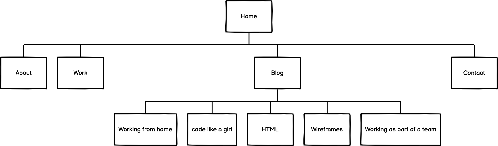
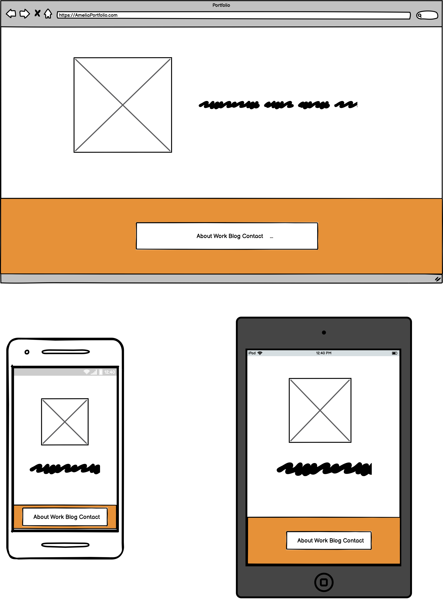
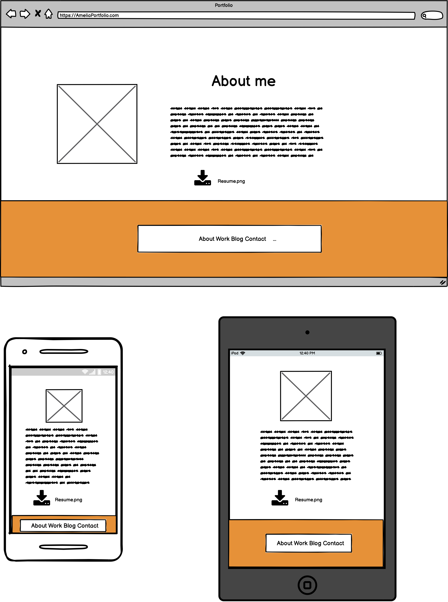
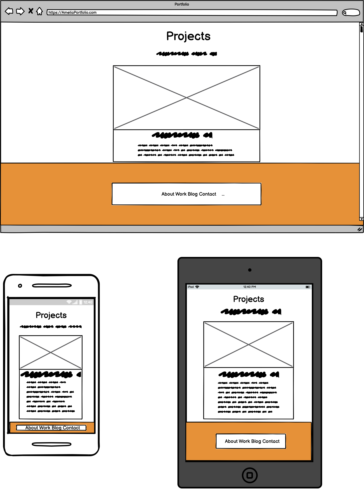
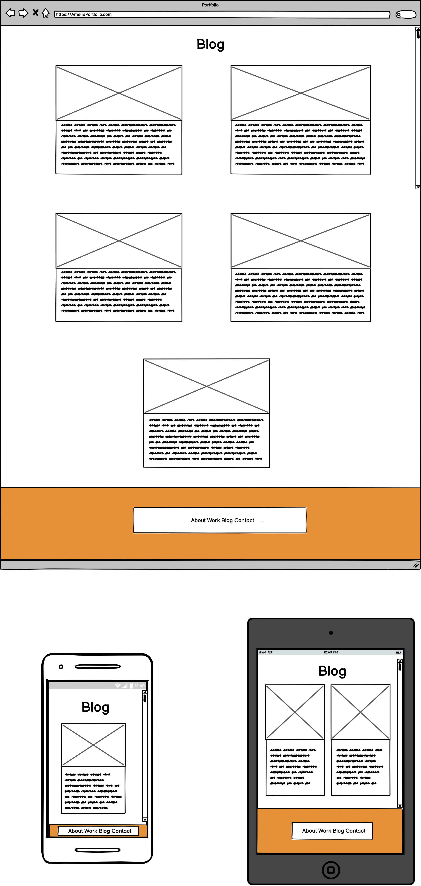
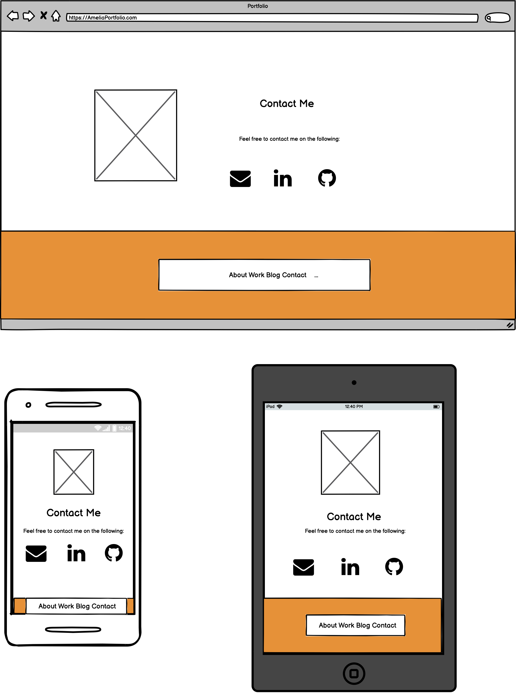

## Amelia’s Portfolio

My [Website](https://amelia-jones-t1a2.netlify.app)

My [Github Repo](https://github.com/ameliaxjones/portfoilo)

The purpose of this portfolio website is to showcase the skills I have acquired from the first few weeks at Coder Academy.

The aim was to create a responsive website showcasing skills and projects i create whilst in my course. With the target audience being
that of future employees and recruiters.

## Features
- Sticky bottom nav bar.
- Hover selectors on images.
- Clickable images that link to other pages.
- Icons that link up to matching websites.
- Email button loads up in the designated email provider.
- Cards to help with styling choices.

## Sitemap

## Screenshots

Each screenshot include all media viewports (phones, table and desktop)

## Tech Stack

- HTML
- CSS
- HTTPS
- Netlify

## Credits

- Pixel art and icons were commissioned from an artist on fivver
- Images on the blog and project pages were from www.pexels.com

 
